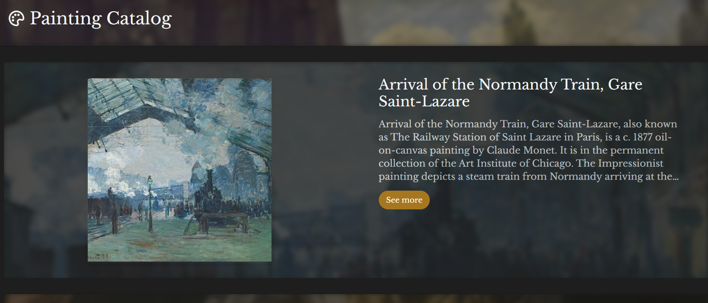
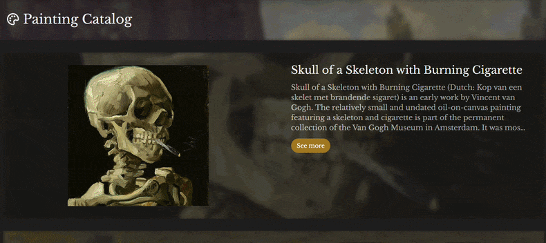
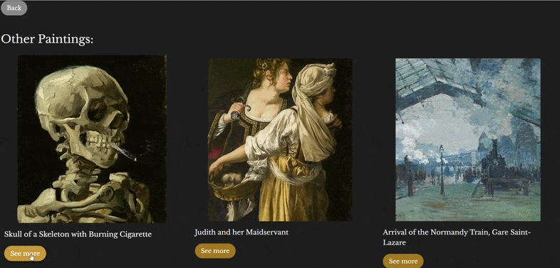
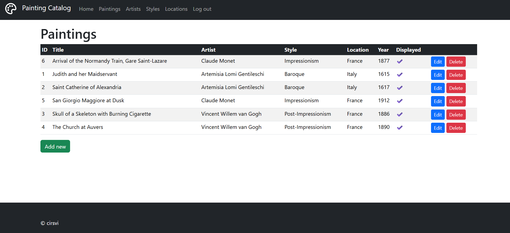

# Laravel - Painting Catalog

<div align="center">

[](#) [](#) [](#) [](#) [](#)

</div>

A web application for browsing a catalog of paintings built with Laravel and React. Initially project was built in the ~2025, this is an updated version.

## Features

- Browse featured paintings on the homepage
- View painting details (title, artist, year, style, location, description)
- Related paintings on each detail page
- Admin area with login: CRUD for paintings, artists, styles, locations

## Tech Stack

- **Backend:** Laravel 11, PHP 8.5
- **Frontend:** React 19, Vite, Tailwind CSS
- **Admin UI:** Blade + Bootstrap
- **Database:** SQLite

## Setup

Requires PHP 8.2+, Composer, Node.js 18+.

```bash
git clone https://github.com/cirsvi/laravel-painting-catalog.git
cd laravel-painting-catalog

cp .env.example .env
php artisan key:generate

composer install
# Create the SQLite database file:
#   Windows (PowerShell):  New-Item database/database.sqlite -ItemType File
#   macOS / Linux:         touch database/database.sqlite
php artisan migrate --seed

npm install
```

## Running

Two terminals:
```bash
npm run dev          # terminal 1 - Vite
php artisan serve    # terminal 2 - Laravel
```

Open `http://localhost:8000`

## Admin Access
- Login: `http://localhost:8000/login`
- Credentials: `test@example.com` / `password`

## Screenshots
### Homepage


### Scrolling the catalog


### Painting detail


### Navigating to a related painting


### Admin panel


## Notes
- The app ships with an empty database (only a test user is seeded). Add paintings via the admin panel at `/login`.
- Painting images are served from `public/images/`.